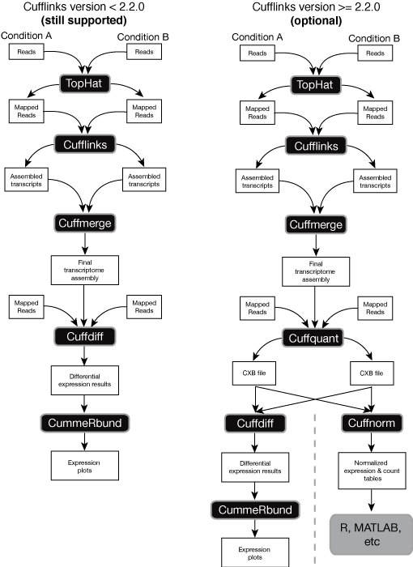
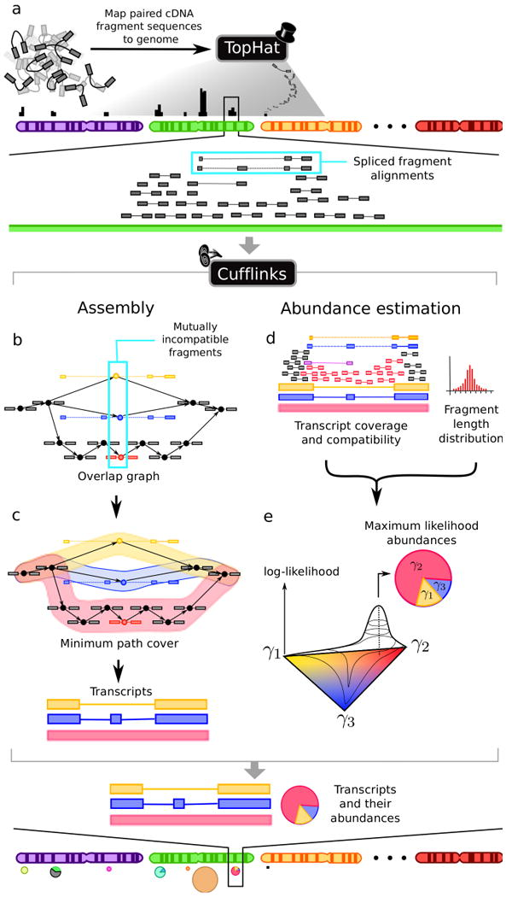
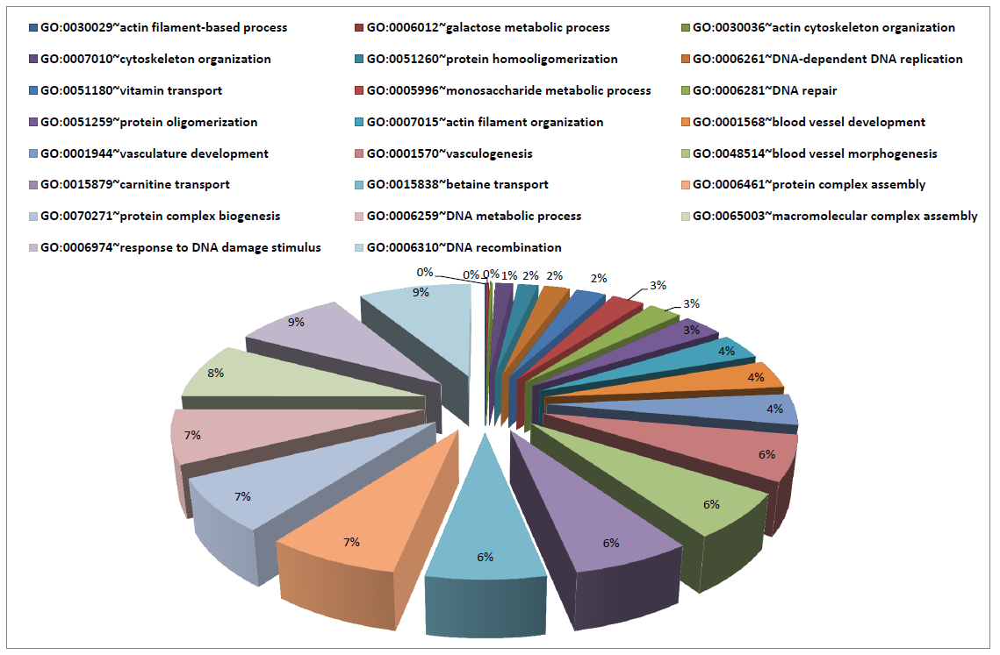

#Alineamientos:
---
*por **Javier robles***

##TOPHAT

***Alinea "reads"contra un genoma de referencia utilizando Bowtie e identifica Simple junctions entre exones*** 

*TopHat is a fast splice junction mapper for RNA-Seq reads. It aligns RNA-Seq reads to mammalian-sized genomes using the ultra high-throughput short read aligner Bowtie, and then analyzes the mapping results to identify splice junctions between exons.*

---
##BOWTIE

***Alineador utra-rapido Alinea "reads" contra el ensamble***

*Bowtie is an ultrafast and memory-efficient tool for aligning sequencing reads to long reference sequences. It is particularly good at aligning reads of about 50 up to 100s or 1,000s of characters, and particularly good at aligning to relatively long (e.g. mammalian) genomes. Bowtie 2 indexes the genome with an FM Index to keep its memory footprint small: for the human genome, its memory footprint is typically around 3.2 GB. Bowtie 2 supports gapped, local, and paired-end alignment modes.*

---

##CUFFLINKS
*Flujo de los "softwares" involucrados* 

---

##Como se aplica:

---

Mi Grafica:

 